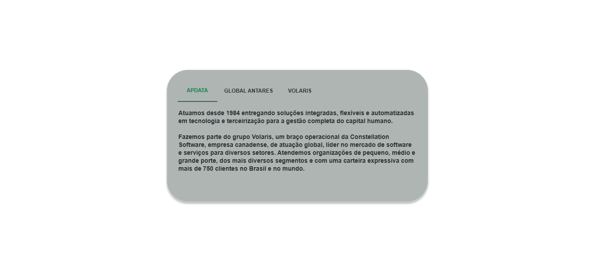
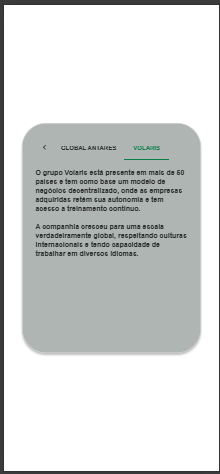

# 🚀 Empresa X test

- Interface de usuário criada para processo seletivo da empresa X, feita com **React + Vite**, **MUI**, e outros.
- Este é um projeto **ReactJS** criado com `npm create vite@latest`.
- Para executá-lo, é necessário ter **Node.js 18+ ou 20+**. Consulte Doc Vite.dev.

---

## 🚀 Tecnologias Utilizadas

- **React + Vite**
- **MUI (Material-UI)**
- **TypeScript**

---

## 💻 Como executar o projeto

### 1️⃣ Clone o repositório

- `git clone https://github.com/Pedro-costa99/apdata-tab-panel.git`
- `cd apdata-tab-panel`
- `code .`

### 2️⃣ Instale as dependências

- `npm install`

### 3️⃣ Inicie o servidor de desenvolvimento

- `npm run dev`
- Acesse `http://localhost:3000` no navegador para ver o resultado.

## Licença 📜

- Este projeto foi desenvolvido exclusivamente para o processo seletivo da empresa **X** e não possui uma licença pública.

---

## 🖥️ UI Implementada - PC

## 📱 UI Implementada - Mobile

